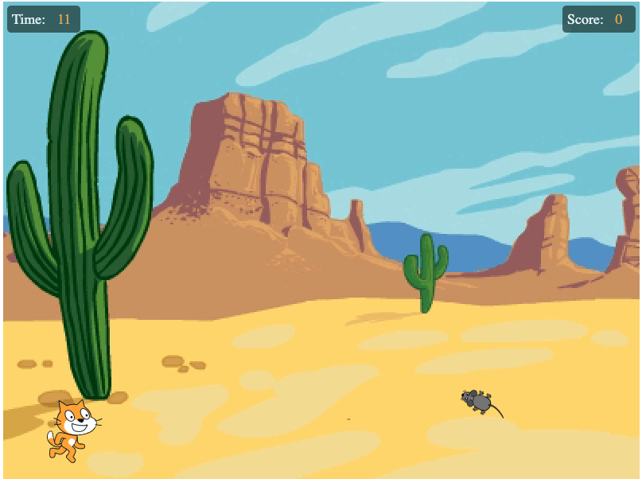

# Javascript

A cat chasing a mouse game

# Live game on github pages

https://pages.github.corp.ebay.com/Shipping-GPLT/interview/children/js/catChasingMouse/catChasingMouse.html

# Steps

## Create the html page

    <!doctype html>
    <html lang="en-US">
    <head>
        
    
        <meta charset="utf-8"/>
        <title>Gamedev Canvas Workshop</title>
        
    </head>
    <body>
    
    

        
        
    

    
    
    </body>
    </html>

## Write a basic loop game and draw the sprites

    const $cat = $('#cat')
    let catX = 50
    let catY = 500

    const $mouse = $('#mouse')
    let mouseX = 350
    let mouseY = 400
    let mouseRot = 0

    function draw() {
        $cat.css('margin-left', catX + 'px')
        $cat.css('margin-top', catY + 'px')

        $mouse.css('margin-left', mouseX + 'px');
        $mouse.css('margin-top', mouseY + 'px');
        $mouse.css('transform', 'rotate(' + mouseRot + 'deg)');
    }

    function update() {
        
    }

    function run() {
        update()
        draw()
    }

    setInterval(run, 50)

## move the mouse

variables:

    const maxY = 350

    const mouseSize = 60
    const mouseSpeed = 5
    const mouseRotation = 10

on update() call moveMouse():

    function moveMouse() {
        if (randomInt(1) === 0) {
            mouseRot = mouseRot - mouseRotation
        } else {
            mouseRot = mouseRot + mouseRotation
        }
        mouseX = mouseX + Math.cos(degToRad(mouseRot)) * mouseSpeed
        mouseY = mouseY + Math.sin(degToRad(mouseRot)) * mouseSpeed

        if (mouseX < 0 || mouseX > screenWidth - mouseSize) {
            mouseRot = mouseRot + 180
        }

        if (mouseY < maxY || mouseY > screenHeight - mouseSize) {
            mouseRot = mouseRot + 180
        }
    }

    function update() {
        moveMouse()
    }

## move the cat

variables:

    const catSpeed = 10
    const catSize = 80

when keys are pressed call moveCat():

    function moveCat(e) {
        switch (e.code) {
            case 'ArrowRight':
                if (catX < screenWidth - catSize) {
                    catX = catX + catSpeed
                }
                break
            case 'ArrowLeft':
                if (catX > 0) {
                    catX = catX - catSpeed
                }
                break;
            case 'ArrowUp':
                if (catY > maxY) {
                    catY = catY - catSpeed
                }
                break;
            case 'ArrowDown':
                if (catY < screenHeight - catSize) {
                    catY = catY + catSpeed
                }
                break;
        }
    }

    window.onkeydown = function(e) {
        moveCat(e)
    }

# Time and Score

style:

    .box {
        position: absolute;
        background-color: darkslategrey;
        opacity: 0.8;
        color: white;
        font-size: 18px;
        padding: 3px;
        border-radius: 5px;
        border: 3px solid darkslategray;
    }

    .box span {
        margin-left: 10px;
        color: orange;
    }

    #time-box {
        margin-top: 5px;
        margin-left: 5px;
        width: 80px;
    }

    #score-box {
        margin-top: 5px;
        margin-left: 703px;
        width: 80px;
    }

html:

    
Time: 

    
Score: 

variables:

    let time = 15
    const $time = $('#time')
    let score = 0
    const $score = $('#score')

draw():

    $time.text(time)
    $score.text(score)

time flow:

    function timeFlow() {
        if (time > 0) {
            time = time - 1
        } else {
            if (score === 0) {
                alert('Uffi! I\'ve eaten no mice!')
            } else if (score === 1) {
                alert('Yummi! I\'ve eaten 1 mouse!')
            } else {
                alert(`Yummi! Yummi! I've eaten ${score} mice!`)
            }

            time = 15
            score = 0
        }
    }

    setInterval(timeFlow, 1000)

# Eat the mouse

on update() checkCatMouseCollision():

    function checkCatMouseCollision() {
        if (catX < mouseX + mouseSize && catX + catSize > mouseX &&
            catY < mouseY + mouseSize && catY + catSize > mouseY) {
            score = score + 1
            mouseX = randomInt(screenWidth - mouseSize)
            mouseY = 400
        }
    }

# Add sounds

variables:

    const soundMeow = new Audio('sound/Meow.wav');
    const soundTada = new Audio('sound/Tada.wav');

checkCatMouseCollision():

    soundMeow.play()

timeFlow():

    soundTada.play()
