# Cat chasing Mouse

https://scratch.mit.edu/projects/1016429319/editor/

# Instructions

# Rename the Cat sprite to `cat`

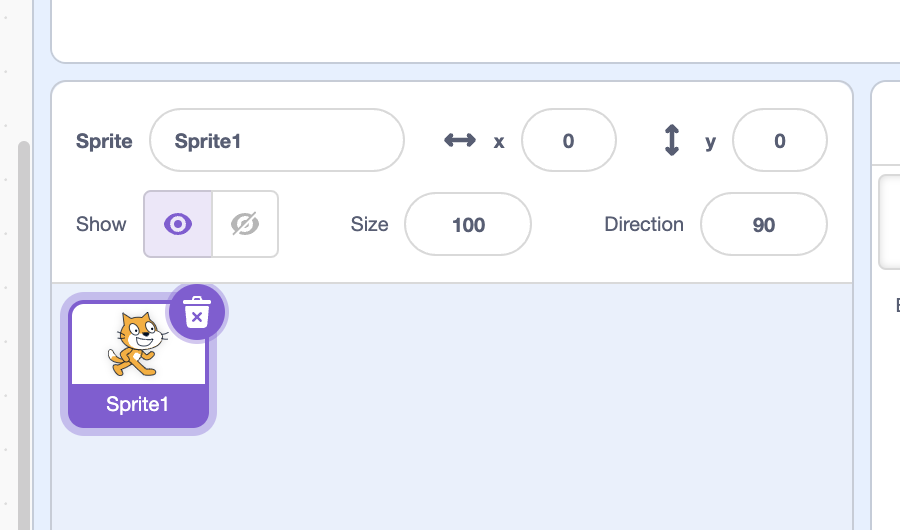

# Add the Desert background

# Set the initial cat position

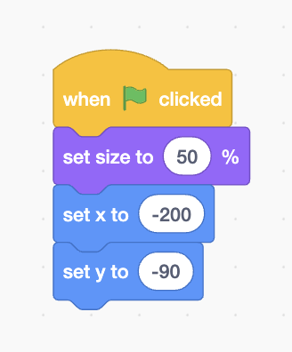

# Move the cat

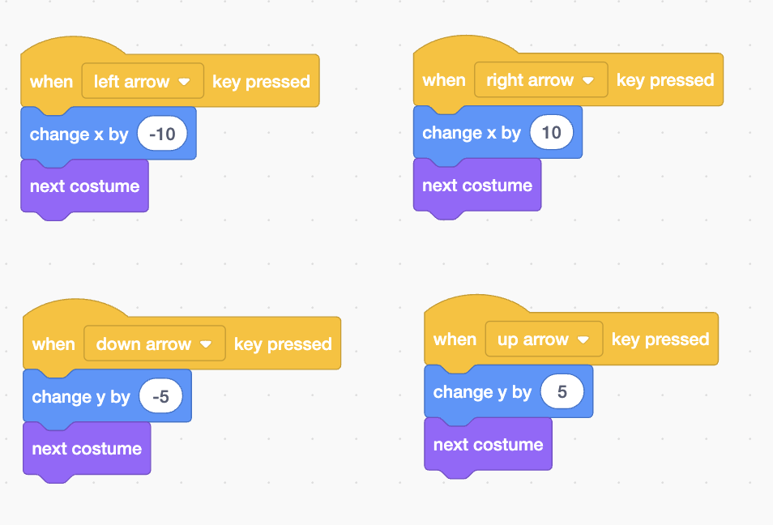

# Add the Mouse sprite

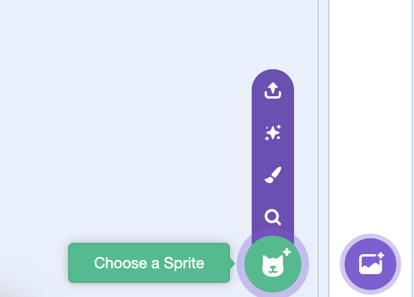
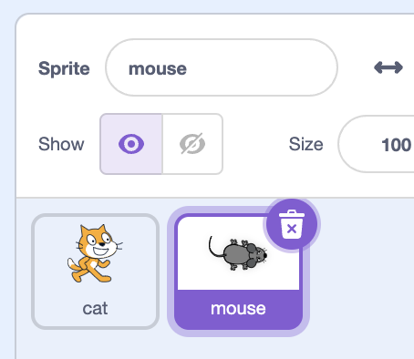

# Move the mouse

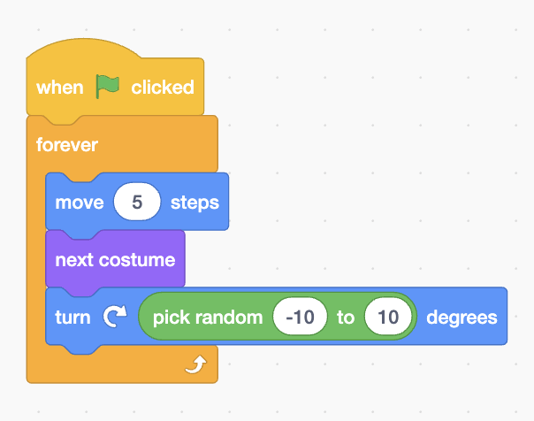

# Don't let me mouse go off screen

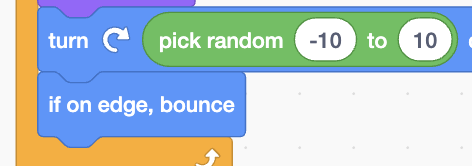

# Cat catching mouse

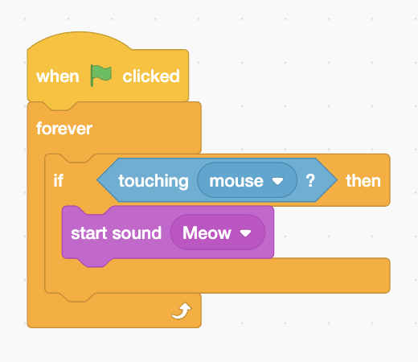

# Make the mouse disappear when caught

On the cat:

On the mouse:

# Make the mouse appear in random locations

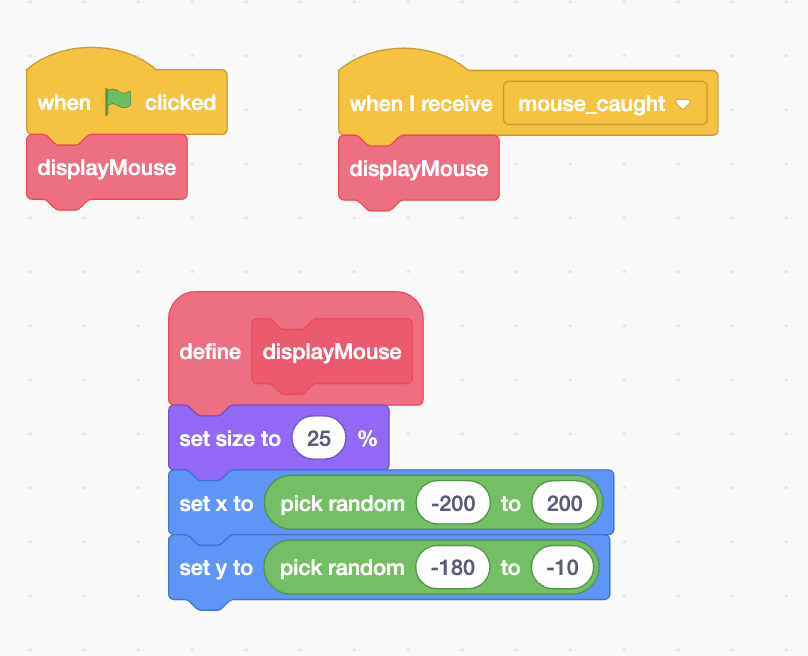

# Add variables score and time

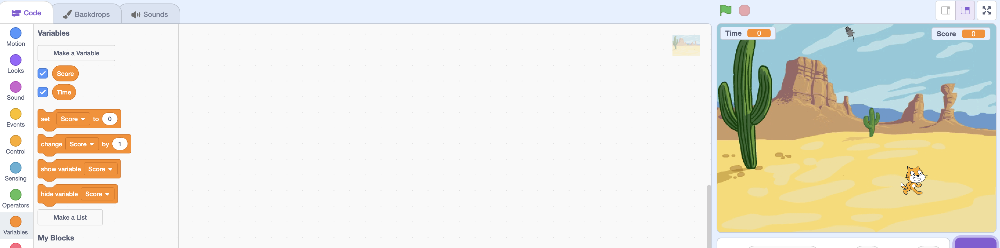

# Increase score when mouse is caught

On the background:
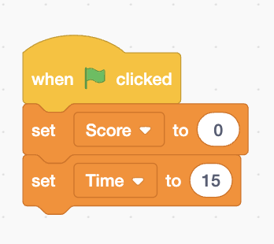

On the cat:
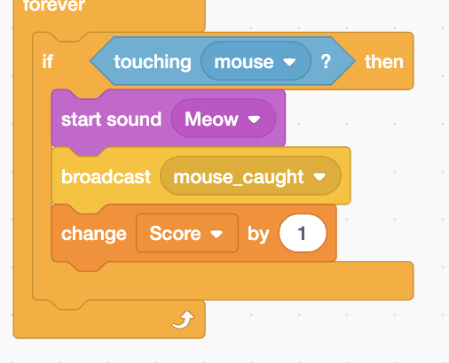

# Make time decrease

On the background:
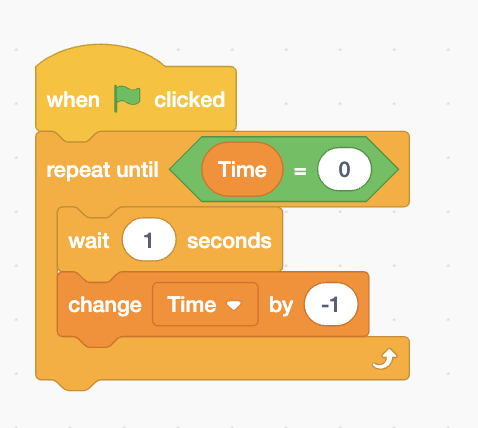
