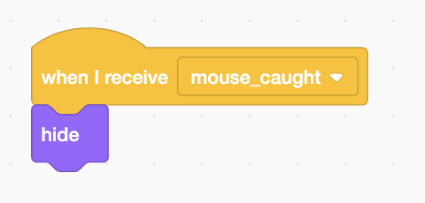

# Cat chasing Mouse

https://scratch.mit.edu/projects/1016429319/editor/

# Instructions

# Rename the Cat sprite to `cat`

# Add the Desert background

# Set the initial cat position

# Move the cat

# Add the Mouse sprite

# Move the mouse

# Don't let me mouse go off screen

# Cat catching mouse

# Make the mouse disappear when caught

On the cat:

On the mouse:

# Make the mouse appear in random locations

# Add variables score and time

# Increase score when mouse is caught

On the background:

On the cat:

# Make time decrease

On the background:

